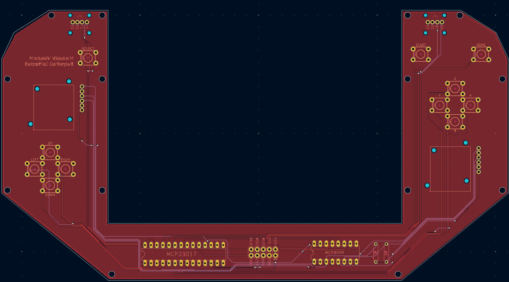

# RetroPie-PSX-Gamepad
A Python script for reading button and joystick values in the Linux User-Space and translating them into inputs for a virtual gamepad.

This project was designed for a handheld RetroPie setup which uses an MCP3008 to handle Analog to Digital conversion and an MCP23017 for GPIO Expansion. The two chips combined can handle a total of 24 inputs (8 for the MCP3008 and 16 for the MCP23017). This does not include any available GPIO pins on the Raspberry Pi itself. There is support for adding button mappings through the native GPIO pins via the gamepad.json file but that is left up to the user.

**Note:** If you set the RP_PSX_GP_LOG environment variable equal to `DEBUG`, the script will print the values of whatever input device was pressed. This is useful for identifying mapping issues or seeing if your input is being registered at all. Additionally, this will also print the PORT values of the MCP23017 which can be useful for identifying which bits are on or off.

# Documentation
### Datasheets
- [MCP3008 Datasheet](https://ww1.microchip.com/downloads/aemDocuments/documents/MSLD/ProductDocuments/DataSheets/MCP3004-MCP3008-Data-Sheet-DS20001295.pdf)
- [MCP23017 Datasheet](https://ww1.microchip.com/downloads/en/devicedoc/20001952c.pdf)
### Tutorials
Tutorial for using an MCP3008 with Joysticks on a Raspberry Pi:
- [How to use a Joystick on the Raspberry Pi (with an MCP3008)](https://tutorials-raspberrypi.com/raspberry-pi-joystick-with-mcp3008/)

Tutorial for using an MCP23017 with a Raspberry Pi:
- [How to use an MCP23017 I2C with a Raspberry Pi Pt. 1](https://www.raspberrypi-spy.co.uk/2013/07/how-to-use-a-mcp23017-i2c-port-expander-with-the-raspberry-pi-part-1/)
- [How to use an MCP23017 I2C with a Raspberry Pi Pt. 2](https://www.raspberrypi-spy.co.uk/2013/07/how-to-use-a-mcp23017-i2c-port-expander-with-the-raspberry-pi-part-2/)
- [How to use an MCP23017 I2C with a Raspberry Pi Pt. 3](https://www.raspberrypi-spy.co.uk/2013/07/how-to-use-a-mcp23017-i2c-port-expander-with-the-raspberry-pi-part-3/)

# Requirements
* Hardware
  * Raspberry Pi 3/4
  * MCP3008
  * MCP23017
  * Push buttons
  * Joysticks
  * Wiring, Breadboards, etc.
* Software
  * Enable SPI in Raspberry Pi configurations
    * `sudo raspi-config` > Options > Enable SPI
  * Enable I2C in Raspberry Pi configurations
    * `sudo raspi-config` > Options > Enable I2C
  * Load uinput Kernel Module
    * `modprobe uinput`
  * Python3
    * `sudo apt install python3`
  * PIP3
    * `sudo apt install pip3`

# Software Installation
### Steps
1. Update / Upgrade
    * `sudo apt update`
    * `sudo apt upgrade`
2. Clone this repository onto your RetroPie device.
    * `git clone https://github.com/nosliwmichael/RetroPie-PSX-Gamepad.git`
3. Install python-uinput
    * `sudo pip3 install python-uinput`
4. Install smbus2
    * `sudo pip3 install smbus2`
5. Update gamepad.json with correct GPIO/PIN/Channel mappings
    * `vim ./RetroPie-PSX-Gamepad/gamepad.json`
6. Test that the script works
    * `sudo python3 ./RetroPie-PSX-Gamepad/src`
7. Setup the script to run as a systemd service so that it starts up on boot.

# Gamepad Configuration
Input mappings for the gamepad can be configured with the gamepad.json file.
Refer to the the python-uinput source code for event code mappings:
https://github.com/tuomasjjrasanen/python-uinput/blob/master/src/ev.py \
The example below should be suitable in most cases unless you are looking to add/remove functionality.\
### gamepad.json
#### Main properties
|Property|Description|
|--------|-----------|
|DEVICE_NAME|This is the name of your controller. It can be set to whatever you want and will be picked up by RetroPie to identify the gamepad. If you change this name after you've configured your input in RetroPie, it may not recognize your gamepad and ask you to reconfigure the input.|
|VENDOR|A vendor ID. Again, this can be set to anything, it's the ID of the maker. Similary to above, if you change this value after you've configured your input in RetroPie, it may not recognize your gamepad and ask you to reconfigure the input.|
|PRODUCT|A product ID. This can also be set to anything, it's the ID of the controller. Similary to above, if you change this value after you've configured your input in RetroPie, it may not recognize your gamepad and ask you to reconfigure the input.|
|GPIO|This array let's you configure inputs connected directly to the Raspberry Pi.|
|MCP3008|This array let's you configure inputs connected to the MCP3008.|
|MCP23017|This array let's you configure inputs connected to the MCP23017.|

#### Event Properties
|Property|Description|
|--------|-----------|
|name|This is the name of the input. You can call this whatever you like. I named mine after their respective [Linux Input Events](https://www.kernel.org/doc/html/latest/input/gamepad.html). The main purpose here was to help with debugging.|
|event_code|Since this project uses python-uinput to map your inputs to a virtual gamepad, these event codes need to match the ones in this file for whichever event you're trying to trigger. [python-uinput/src/ev.py](https://github.com/tuomasjjrasanen/python-uinput/blob/master/src/ev.py). My understanding is that the first value in the tuple represents the type of input [BTN (0x01), REL (0x02), ABS(0x03)] and the second value is the actual linux event code. The ABS ones might look confusing in the gamepad.json file because they have four extra numbers in their tuple. This is strictly for joysticks where the extra values are MIN, MAX, FUZZ and FLAT. |
|pin|This is the GPIO or Pin number on the chip that you connected the input to. For the MCP3008, this is going to correspond to the channel.|
|port|This is only relevant to the MCP23017 to help distinguish which port (A or B) the input is on.|
|is_digital|This is a boolean to help determine the type of input. If analog, this value should be false. Analog values have their own special event handling.|

#### Example of the gamepad.json configurations:
```json
{
    "DEVICE_NAME": "RetroPie-PSX-Gamepad",
    "VENDOR": 6969,
    "PRODUCT": 420,
    "GPIO" : [
    ],
    "MCP3008" : [
        { "name": "BTN_THUMBL", "event_code": "(0x01, 0x13d)", "pin": 0, "port": null, "is_digital": true },
        { "name": "ABS_X", "event_code": "(0x03, 0x00, 0, 1023, 50, 0)", "pin": 1, "port": null, "is_digital": false },
        { "name": "ABS_Y", "event_code": "(0x03, 0x02, 0, 1023, 50, 0)", "pin": 2, "port": null, "is_digital": false },
        { "name": "BTN_THUMBR", "event_code": "(0x01, 0x13e)", "pin": 5, "port": null, "is_digital": true },
        { "name": "ABS_RX", "event_code": "(0x03, 0x03, 0, 1023, 50, 0)", "pin": 6, "port": null, "is_digital": false },
        { "name": "ABS_RY", "event_code": "(0x03, 0x04, 0, 1023, 50, 0)", "pin": 7, "port": null, "is_digital": false }
    ],
    "MCP23017" : [
        { "name": "BTN_MODE", "event_code": "(0x01, 0x13c)", "pin": 7, "port": "A", "is_digital": true },
        { "name": "BTN_START", "event_code": "(0x01, 0x13b)", "pin": 6, "port": "A", "is_digital": true },
        { "name": "BTN_SELECT", "event_code": "(0x01, 0x13a)", "pin": 5, "port": "A", "is_digital": true },
        { "name": "BTN_TL", "event_code": "(0x01, 0x136)", "pin": 4, "port": "A", "is_digital": true },
        { "name": "BTN_TR", "event_code": "(0x01, 0x137)", "pin": 3, "port": "A", "is_digital": true },
        { "name": "BTN_TL2", "event_code": "(0x01, 0x138)", "pin": 2, "port": "A", "is_digital": true },
        { "name": "BTN_TR2", "event_code": "(0x01, 0x139)", "pin": 1, "port": "A", "is_digital": true },

        { "name": "BTN_DPAD_LEFT", "event_code": "(0x01, 0x222)", "pin": 7, "port": "B", "is_digital": true },
        { "name": "BTN_DPAD_UP", "event_code": "(0x01, 0x220)", "pin": 6, "port": "B", "is_digital": true },
        { "name": "BTN_DPAD_RIGHT", "event_code": "(0x01, 0x223)", "pin": 5, "port": "B", "is_digital": true },
        { "name": "BTN_DPAD_DOWN", "event_code": "(0x01, 0x221)", "pin": 4, "port": "B", "is_digital": true },
        { "name": "BTN_SOUTH", "event_code": "(0x01, 0x130)", "pin": 3, "port": "B", "is_digital": true },
        { "name": "BTN_WEST", "event_code": "(0x01, 0x134)", "pin": 2, "port": "B", "is_digital": true },
        { "name": "BTN_NORTH", "event_code": "(0x01, 0x133)", "pin": 1, "port": "B", "is_digital": true },
        { "name": "BTN_EAST", "event_code": "(0x01, 0x131)", "pin": 0, "port": "B", "is_digital": true }
    ]
}
```

# Wiring
The following is a diagram of the MCP3008. This chip is responsible for converting analog signals, such as a joystick, into digital signals that are compatible with the Raspberry Pi. It uses the SPI interface for communication with the Raspberry Pi and it supports up to 8 channels. Since the MCP3008 channels output a 10 bit signal, this means the value could range between 0 (0000000000) and 1023 (1111111111).\
Additionally, a single joystick can output 3 signals; X-Axis (Analog), Y-Axis (Analog), Click (Digital). The chip's input channels can also receive digital signals like from the joystick's button click; the output would be either 0 or 1023. In my diagrams, I chose to use one channel for each of my joystick's buttons. However, if I were to need more channels for additional analog inputs, like for my left and right triggers or a volume knob, I will need to reassign the joystick buttons to an available GPIO on the MCP23017 or the Raspberry Pi.\
Keep in mind, if you choose to use the MCP3008 for push buttons, you should make use of pull up resistors because the MCP3008 does not have any internal pull up resistors of its own.


The following is a diagram of the MCP23017. This chip is a simple GPIO port expander which allows us to attach more devices to the Raspberry Pi by leveraging its I2C interface. There is an SPI variation of this chip if you feel that the two wire I2C interface is too slow. For simple button inputs, I think it works just fine.\
The three address pins (A0, A1, A2) are used to assign the chip an address by pulling each of the HIGH or LOW. In my configuration, I've wired each address to Ground (LOW), which means the address of my MCP23017 is 0x20 (32).\
Fortunately, the MCP23017 has internal pull up resistors for each of the GPIO ports (GPA / GPB) which I've enabled in the python scrip by default. Therefore, it is not necessary to wire up any external pull up resistors for your buttons/switches.\
The chip also has two pins for enabling interrupts. In theory, this could be used to allow the MCP23017 to inform the Raspberry Pi that a button press/depress occurred, rather than the Raspberry Pi polling the chip every 0.05 seconds. This would be more efficient in terms of CPU usage. However, because my use case uses an MCP3008, which does not support interrupts, I needed to implement a polling mechanism anyway. With that in mind I decided it wasn't worth supporting interrupt behavior at this time. In the future I could update the code to use interrupts if only the MCP23017 is in use and not the Pi's GPIO or the MCP3008.


In this diagram, I wanted to give you an idea of how each of the components could be configured to work with this gamepad driver. You can see all of the D-Pad and Action buttons are wired up to the B port pins on the MCP23017. The left/right shoulder/trigger buttons as well as the start, select, and home (hotkey) buttons are all wired up to the A port. There are still two open pins on port A which could be used for a power button or whatever you want.\
The small raspberry icons are there to tell you how each pin of the MCP3008/MCP23017 map to their corresponding GPIO pin on the Raspberry Pi.


Finally, this is an example of the entire thing connected with a combination of wire and jumper cables. My Raspberry Pi is attached to a [CanaKit Raspberry Pi GPIO Breakout Board](https://www.canakit.com/raspberry-pi-gpio-breakout.html) to make it easier to wire the ICs to the correct GPIO pin. If you boot up RetroPie with the script and this controller configuration, it should detect your gamepad and allow you to configure your inputs. Once you've confirmed it works, the final step would be to move this setup to something more official, like a perfboard or a custom PCB.


# Custom PCB
Using software like KiCAD, we can draw up a schematic with what we've learned on our breadboard. We can use the built in library to select the components we want or design our own symbols/footprints for those that don't have them. With that out of the way, we can make a board file out of the schematic and lay things out the way we want them. The final step is to generate the files the manufacturer will need to create the board for us.


